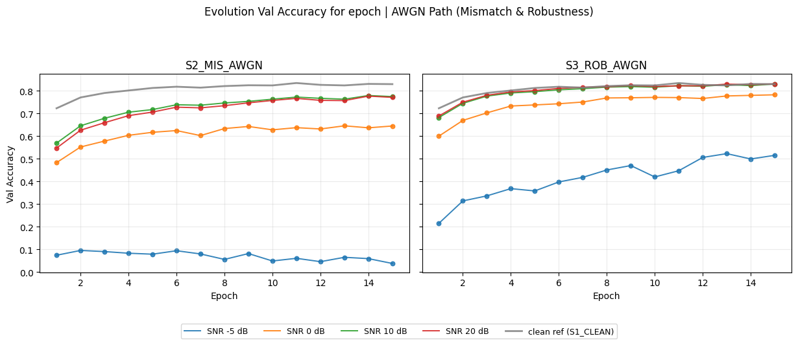
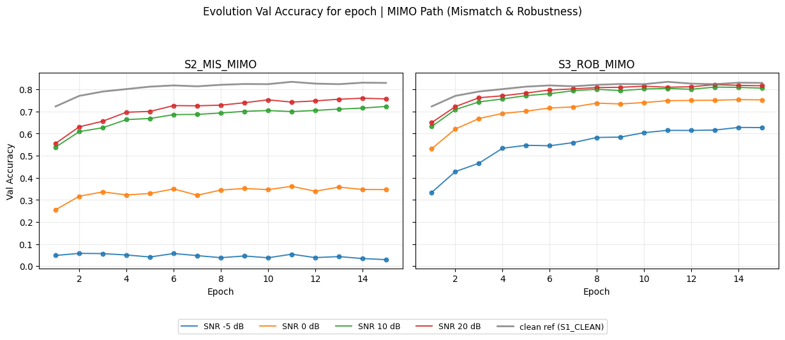
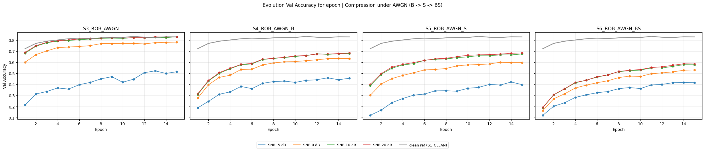
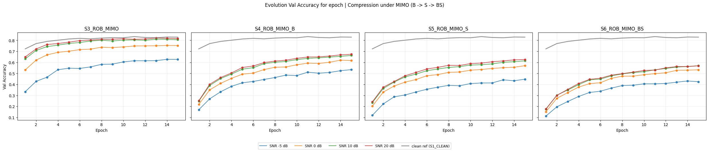
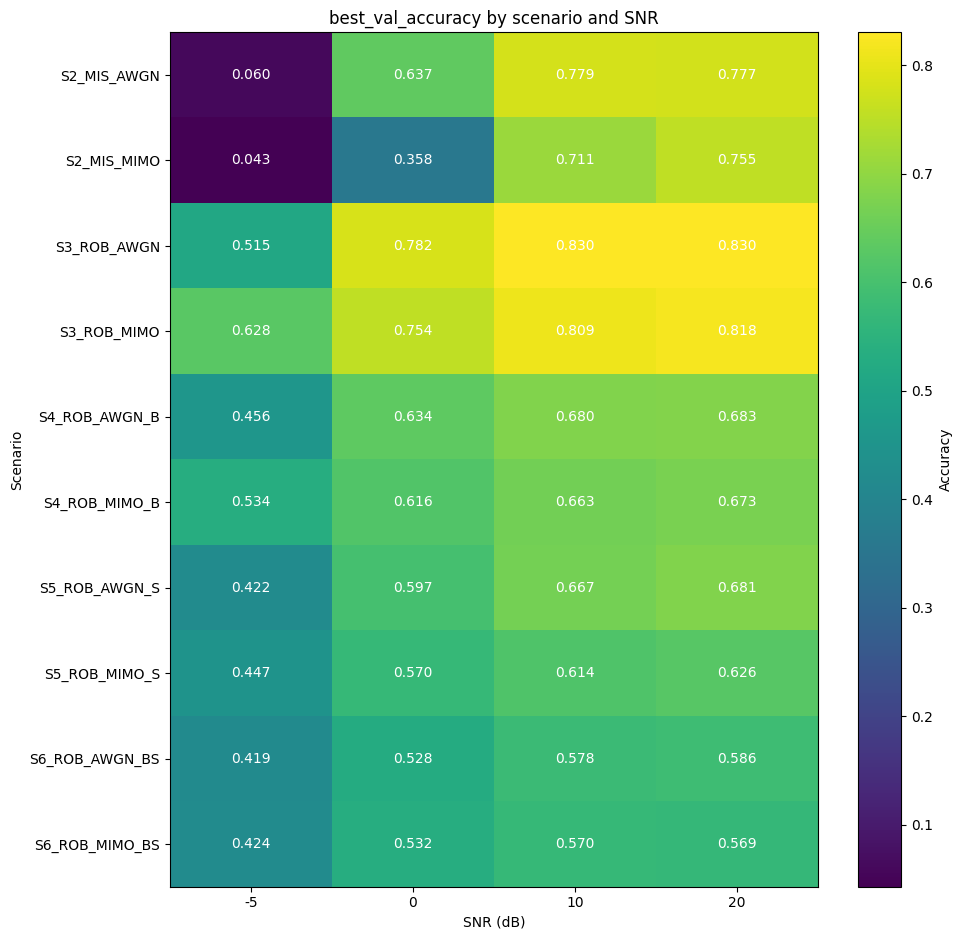
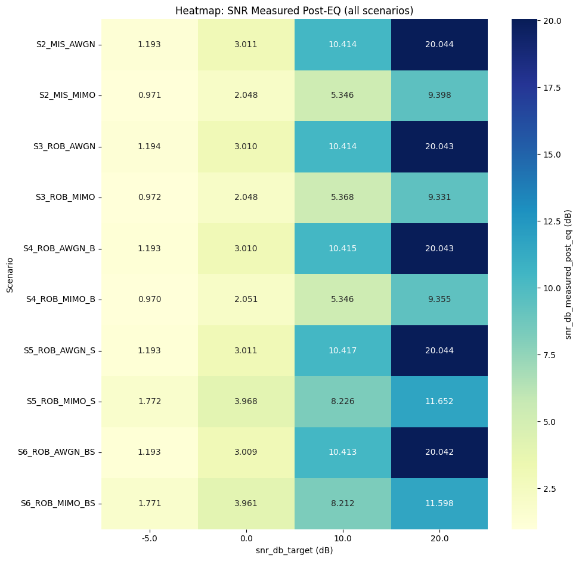

# Baseline Description and Operational Scenarios

This document extends [test_description.md](test_description.md) and describes the operational scenarios to test in a controlled way on the same split-learning ViT pipeline.

The reference setup (model, dataset, split index, optimization, and evaluation logic) remains aligned with the current test description:
- Model: DeiT Tiny (`deit_tiny_patch16_224.fb_in1k`)
- Dataset: CIFAR-100
- Split index: 3
- Optimizer: Adam
- Main metric: validation accuracy (with SNR sweep when channel is enabled)

For the scenarios below, batch selection is intentionally ignored for now. The focus is on:
- channel ON/OFF
- bottleneck compression ON/OFF
- token selection ON/OFF

## 1. Scope and Goal

The goal is to compare clean and noisy communication regimes in a progressive way, separating:
- pure model fine-tuning effects
- channel robustness effects (AWGN-like vs MIMO)
- compression effects (bottleneck, then token selection)

This allows a fair comparison from the simplest baseline to the most constrained communication setting.

## 2. Scenario Matrix

## S1_CLEAN: Reference Clean (no channel, no compression)

- Train: channel OFF, bottleneck OFF, token selection OFF
- Validation: channel OFF, bottleneck OFF, token selection OFF

Use case:
- Reference upper-bound for model behavior without transmission artifacts.

Expected outcome:
- Best semantic performance, no communication-induced degradation.

---

## S2_MIS_AWGN: Mismatch AWGN (Train clean, validate with AWGN)
- Train: channel OFF, bottleneck OFF, token selection OFF
- Validation: channel ON, bottleneck OFF, token selection OFF (AWGN-like)

Use case:
- Measure generalization gap between clean training and noisy/no-channel-mismatch validation.

Expected outcome:
- Accuracy drop vs S1_CLEAN, larger at lower SNR.

---

## S2_MIS_MIMO: Mismatch MIMO (Train clean, validate with MIMO)

- Train: channel OFF, bottleneck OFF, token selection OFF
- Validation: channel ON, bottleneck OFF, token selection OFF (MIMO)

Use case:
- Measure generalization gap between clean training and noisy MIMO validation.

Expected outcome:
- Accuracy drop vs S1_CLEAN, larger at lower SNR.
- Difference between S2_MIS_AWGN and S2_MIS_MIMO depends on equalizer and fading profile.

---

## S3_ROB_AWGN: Robust No-Comp AWGN (Channel ON during Train)

- Train: channel ON (AWGN), bottleneck OFF, token selection OFF
- Validation: channel ON (AWGN), bottleneck OFF, token selection OFF

Use case:
- Robust training directly in the AWGN regime.

Expected outcome:
- Better robustness than S2_MIS_AWGN at low SNR.
- Usually lower clean-performance ceiling than S1_CLEAN.

---

## S3_ROB_MIMO: Robust No-Comp MIMO (Channel ON during Train)

- Train: channel ON (MIMO), bottleneck OFF, token selection OFF
- Validation: channel ON (MIMO), bottleneck OFF, token selection OFF

Use case:
- Robust training directly in the MIMO regime.

Expected outcome:
- Better robustness than S2_MIS_MIMO at low SNR.
- Usually lower clean-performance ceiling than S1_CLEAN.

---

---

## S4_ROB_AWGN_B: Robust AWGN + Bottleneck only

- Train: channel ON (AWGN-like), token selection OFF, bottleneck ON
- Validation: channel ON (AWGN-like), token selection OFF, bottleneck ON

Use case:
- Isolate bottleneck-only compression under scalar/identity-channel conditions.

Expected outcome:
- Accuracy drop vs S3_ROB_AWGN due to compression.

---

## S4_ROB_MIMO_B: Robust MIMO + Bottleneck only

- Train: channel ON (MIMO), token selection OFF, bottleneck ON
- Validation: channel ON (MIMO), token selection OFF, bottleneck ON

Use case:
- Quantify the isolated effect of bottleneck under MIMO channel constraints.

Expected outcome:
- Trade-off between communication efficiency and accuracy.
- Sensitivity to bottleneck output dimension and SNR.
- Compare with S3_ROB_MIMO to see impact of dimensionality reduction.
- Direct comparability with S4_ROB_AWGN_B to separate channel-type impact.

---

## S5_ROB_AWGN_S: Robust AWGN + Token Selection only

- Train: channel ON (AWGN-like), token selection ON, bottleneck OFF
- Validation: channel ON (AWGN-like), token selection ON, bottleneck OFF

Use case:
- Isolate token-selection effects without dimensionality reduction in AWGN.

Expected outcome:
- Better retention than S4_ROB_AWGN_B when token importance is well estimated.

---

## S5_ROB_MIMO_S: Robust MIMO + Token Selection only

- Train: channel ON (MIMO), token selection ON, bottleneck OFF
- Validation: channel ON (MIMO), token selection ON, bottleneck OFF

Use case:
- Measure the isolated effect of semantic token filtering without dimensionality reduction in MIMO.
- Contrast with S4_ROB_MIMO_B to understand the relative benefit of token selection alone.

Expected outcome:
- Communication savings from token selection alone.
- Direct comparison against S5_ROB_AWGN_S highlights channel dependency of token-selection gains.

---

## S6_ROB_AWGN_BS: Robust AWGN + Combined Compression (Bottleneck + Selection)

- Train: channel ON (AWGN-like), bottleneck ON, token selection ON
- Validation: channel ON (AWGN-like), bottleneck ON, token selection ON

Use case:
- Full constrained AWGN-like setup combining both compression mechanisms.

Expected outcome:
- Strongest compression in AWGN branch.

---

## S6_ROB_MIMO_BS: Robust MIMO + Combined Compression (Bottleneck + Selection)

- Train: channel ON (MIMO), bottleneck ON, token selection ON
- Validation: channel ON (MIMO), bottleneck ON, token selection ON

Use case:
- Full constrained MIMO setting with both semantic token filtering and bottleneck dimensionality reduction.

Expected outcome:
- Strongest communication savings combining both compression mechanisms.
- Accuracy depends on quality of token importance estimation and channel allocation strategy.
- Directly comparable with S6_ROB_AWGN_BS.

---

## 3. Validation Accuracy Evolution per Epoch

The plots below show the validation accuracy evolution per epoch for the scenario using AWGN channel and MIMO channel. 

The aim is evaluate the model's ability to learn the task in the presence of compression compare to the scenario without compression but with channel open in training and validation.

The first plot show the validation accuracy evolution per epoch for the scenario using AWGN channel.

The second plot show the validation accuracy evolution per epoch for the scenario using MIMO channel.

---

## 4. Overall result in terms of accuracy and SNR

The plots below show the overall results in terms of accuracy and SNR for the different scenarios.
First, the best validation accuracy for each scenario is shown.

Then, the measured post-equalization SNR for each scenario is shown.

---

## 5. Results Folder Naming (Current)

- S1_CLEAN -> `results/S1_CLEAN/`
- S2_MIS_AWGN -> `results/S2_MIS_AWGN/`
- S2_MIS_MIMO -> `results/S2_MIS_MIMO/`
- S3_ROB_AWGN -> `results/S3_ROB_AWGN/`
- S3_ROB_MIMO -> `results/S3_ROB_MIMO/`
- S4_ROB_AWGN_B -> `results/S4_ROB_AWGN_B/`
- S4_ROB_MIMO_B -> `results/S4_ROB_MIMO_B/`
- S5_ROB_AWGN_S -> `results/S5_ROB_AWGN_S/`
- S5_ROB_MIMO_S -> `results/S5_ROB_MIMO_S/`
- S6_ROB_AWGN_BS -> `results/S6_ROB_AWGN_BS/`
- S6_ROB_MIMO_BS -> `results/S6_ROB_MIMO_BS/`
