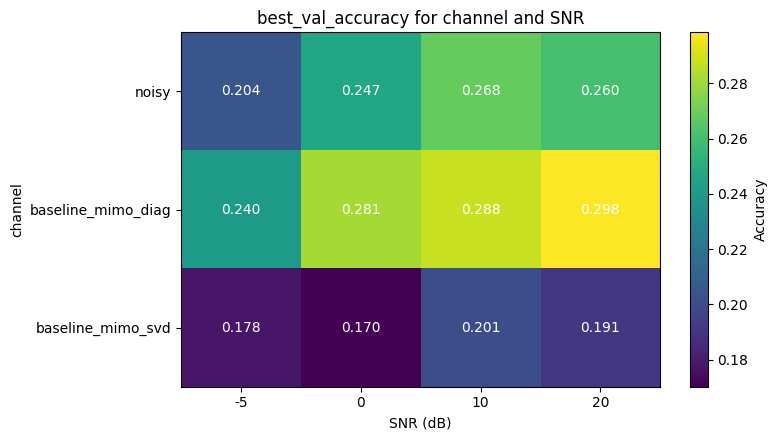
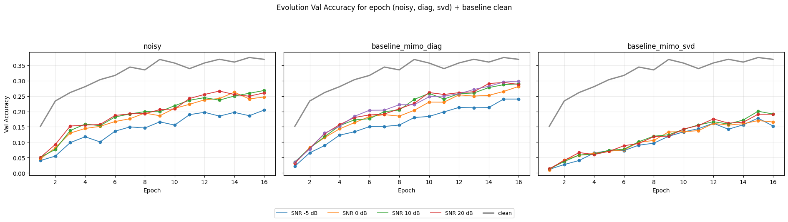
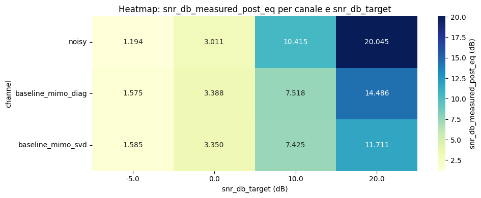
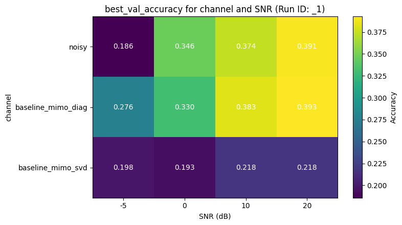
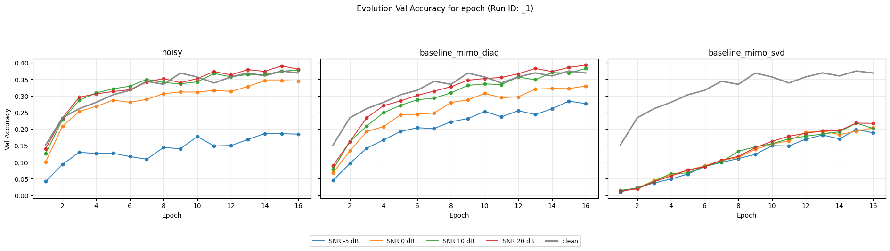

# Scenario 1

Test using the Bottleneck tool

## 1. Plots

### 1.1. Best Validation Accuracy Heatmap
This subsection displays a heatmap summarizing the `best_val_accuracy` obtained for different communication channels (`noisy`, `baseline_mimo_diag`, `baseline_mimo_svd`) across various Signal-to-Noise Ratio (**SNR**) levels.
- **Channels**: Noisy (AWGN), Diagonal MIMO, and SVD MIMO.
- **Objective**: Compare the robustness of different transmission strategies under various noise conditions.
- **Baseline**: The accuracy on the `clean` channel serves as the upper-bound reference for ideal, error-free transmission.

### 1.2. Validation Accuracy Evolution per Epoch
This set of plots visualizes the progression of validation accuracy over training epochs for each communication channel profile.
- **Subplots**: Dedicated panels for `noisy`, `diagonal MIMO`, and `SVD MIMO` channels.
- **SNR Trends**: Multiple curves within each panel represent different Signal-to-Noise Ratio (SNR) levels, showing how channel quality affects learning speed and stability.
- **Baseline Comparison**: The `clean` baseline (gray line) is overlaid on each subplot to demonstrate the performance gap between ideal conditions and various noisy scenarios.
- **Purpose**: This visualization tracks the convergence of the model and compares the efficiency of the different transmission strategies across the entire training duration.

### 1.3. Measured Post-Equalization SNR Heatmap
This heatmap examines the difference between the experimental **Target SNR** and the **Effective SNR** measured after the signal recovery phase at the receiver.
- **Data Points**: It plots the `snr_db_measured_post_eq` for each channel across the target SNR levels.
- **Analysis**: Higher values in the heatmap indicate more successful signal restoration. This is particularly useful for evaluating the effectiveness of equalizers (e.g., MMSE) and spatial mapping strategies in MIMO environments.
- **Benefit**: It helps verify that the experimental conditions match the intended settings and quantifies the signal quality degradation introduced by the channel and recovered by the receiver's logic.

# Scenario 2

Test without using the Bottleneck tool.

## 2. plots

### 2.1. Best Validation Accuracy Heatmap

### 2.2. Validation Accuracy Evolution per Epoch

### 2.3. Measured Post-Equalization SNR Heatmap

