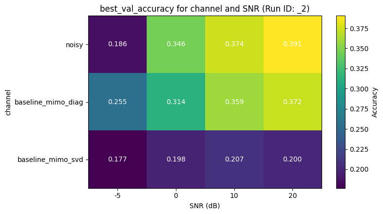
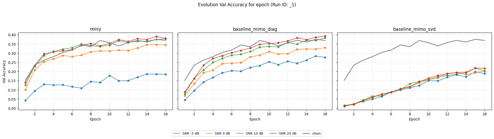
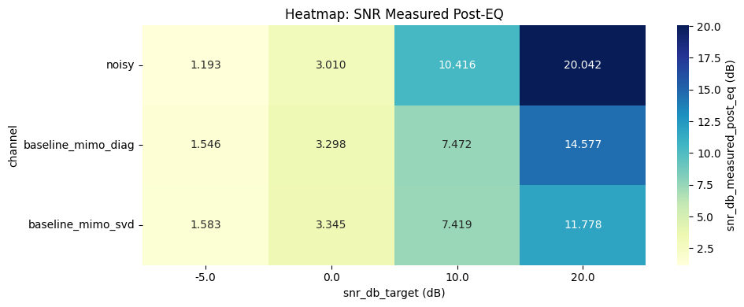
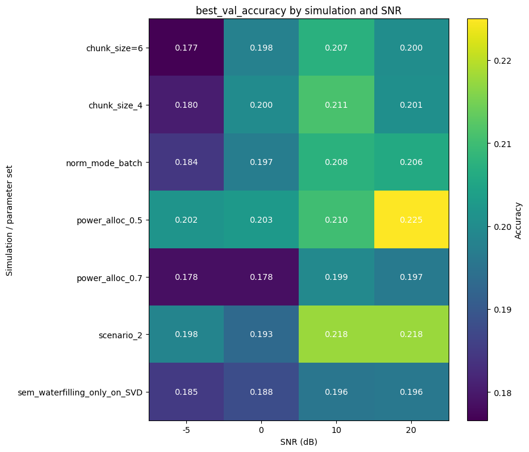
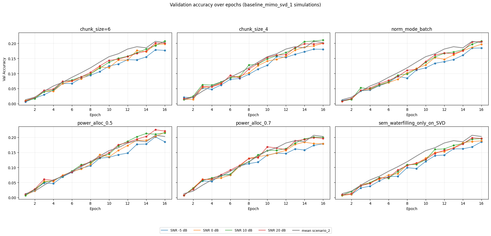
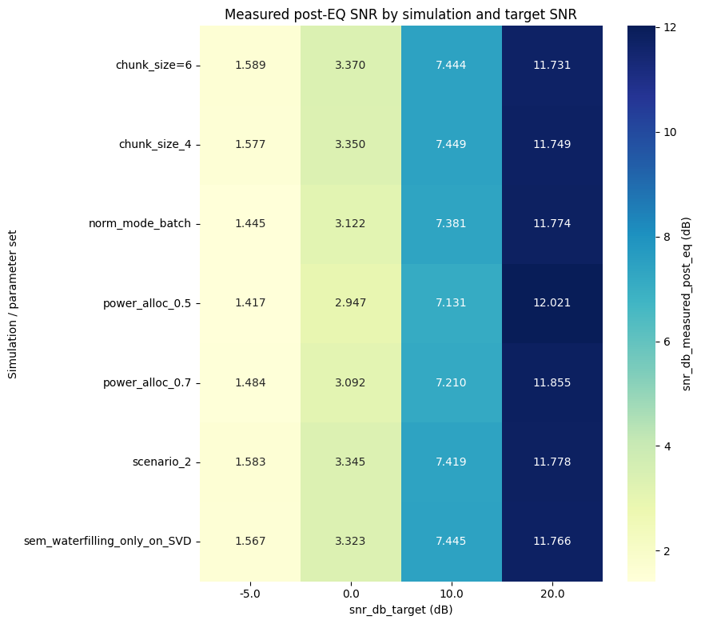
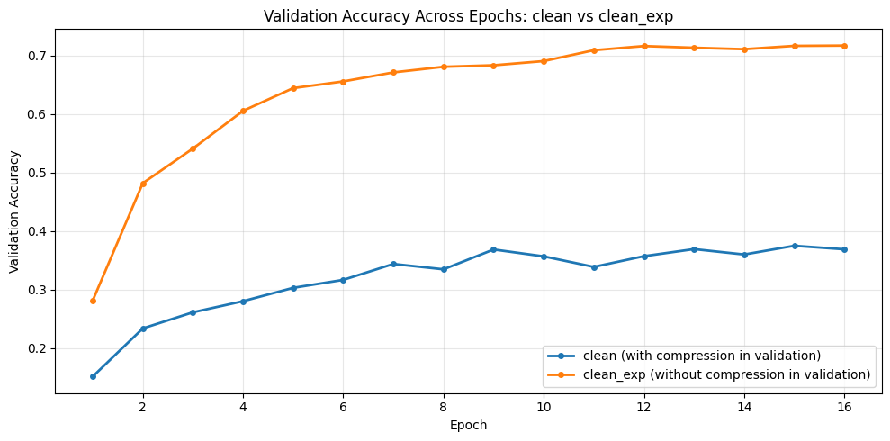

# Scenario 1

Test using the Bottleneck tool

## 1. Plots

### 1.1. Best Validation Accuracy Heatmap
This subsection displays a heatmap summarizing the `best_val_accuracy` obtained for different communication channels (`noisy`, `baseline_mimo_diag`, `baseline_mimo_svd`) across various Signal-to-Noise Ratio (**SNR**) levels.
- **Channels**: Noisy (AWGN), Diagonal MIMO, and SVD MIMO.
- **Objective**: Compare the robustness of different transmission strategies under various noise conditions.
- **Baseline**: The accuracy on the `clean` channel serves as the upper-bound reference for ideal, error-free transmission.

### 1.2. Validation Accuracy Evolution per Epoch
This set of plots visualizes the progression of validation accuracy over training epochs for each communication channel profile.
- **Subplots**: Dedicated panels for `noisy`, `diagonal MIMO`, and `SVD MIMO` channels.
- **SNR Trends**: Multiple curves within each panel represent different Signal-to-Noise Ratio (SNR) levels, showing how channel quality affects learning speed and stability.
- **Baseline Comparison**: The `clean` baseline (gray line) is overlaid on each subplot to demonstrate the performance gap between ideal conditions and various noisy scenarios.
- **Purpose**: This visualization tracks the convergence of the model and compares the efficiency of the different transmission strategies across the entire training duration.

### 1.3. Measured Post-Equalization SNR Heatmap
This heatmap examines the difference between the experimental **Target SNR** and the **Effective SNR** measured after the signal recovery phase at the receiver.
- **Data Points**: It plots the `snr_db_measured_post_eq` for each channel across the target SNR levels.
- **Analysis**: Higher values in the heatmap indicate more successful signal restoration. This is particularly useful for evaluating the effectiveness of equalizers (e.g., MMSE) and spatial mapping strategies in MIMO environments.
- **Benefit**: It helps verify that the experimental conditions match the intended settings and quantifies the signal quality degradation introduced by the channel and recovered by the receiver's logic.

# Scenario 2

Test without using the Bottleneck tool.

## 2. plots

### 2.1. Best Validation Accuracy Heatmap

### 2.2. Validation Accuracy Evolution per Epoch

### 2.3. Measured Post-Equalization SNR Heatmap

# Scenario 3

Test by using the upgraded procedure with:

- ghater applied on antenna domain before the channel projection svd.
- the equalizer MMSE accept the optional parameter stream_power_weights, so the filter is now aligned with the true covariance of the trasmitted symbols.

For detailed information about the changes, see the `comm_module_upgrade.md` and `mimo_upgrade.md` files.

In addition the MIMO diagonal baseline is computed with gains that are drawn for each sample in the batch. This with the aim to study if the performance of the diagonal baseline is affected by the fact that the gains are not the same for all the samples in the batch.

the bottleneck is not used in this scenario.

## 3. Plots

### 3.1. Best Validation Accuracy Heatmap

### 3.2. Validation Accuracy Evolution per Epoch

### 3.3. Measured Post-Equalization SNR Heatmap

# Testing SVD Parameters

Testing with different SVD parameters. Specifically, the following configurations were tested exclusively (one at a time):
- **Normalized mode**: Applied on the batch rather than on individual samples.
- **Internal Semantic Waterfilling**: Applied only within the SVD channel and not across tokens, by setting `power_alloc` to `false`.
- **Alpha parameter**: Using `alpha = 0.7 and 0.5` instead of `1.0` within the internal SVD semantic waterfilling.
- **Chunk size**: Using a chunk size of 4 instead of 1.

For Plot SVD.2, the reference value is the average validation accuracy across different noise configurations for the SVD case with the bottleneck deactivated. This comparison aims to determine if the SVD parameter modifications yield performance improvements over the base case.

## SVD Plots

### SVD.1. Best Validation Accuracy Heatmap

### SVD.2. Validation Accuracy Evolution per Epoch

### SVD.3. Measured Post-Equalization SNR Heatmap

# Comparison between Baseline with Channel/ADC Active vs. Without

## Comparison Plots

### Comparison.1. Validation Accuracy Evolution per Epoch

