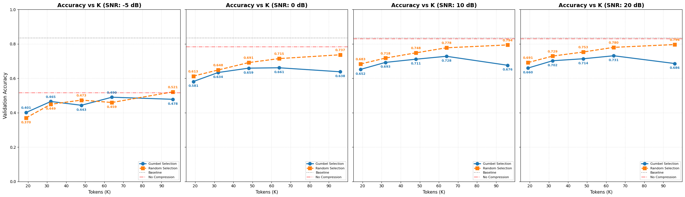
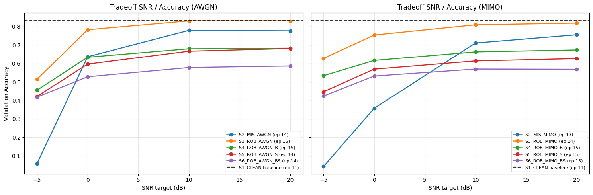
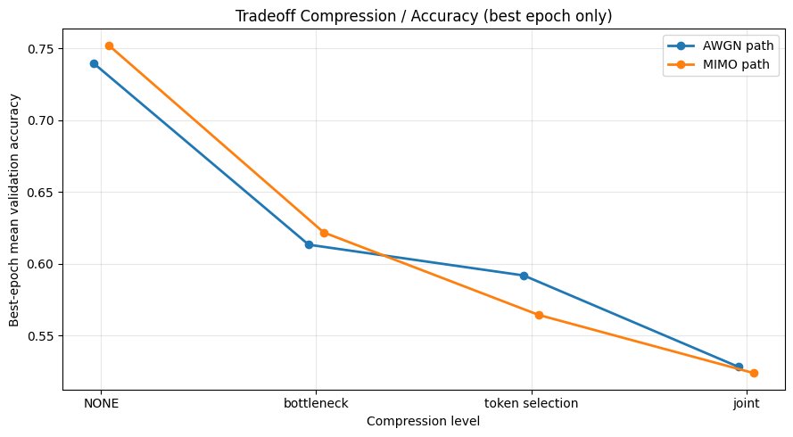

# Update - Comparison between random selection and Gumbel-Softmax selection for different compression levels

To more concretely investigate the differences between the two methods, we tested various scenarios to observe how the two techniques vary depending on the number of tokens being transmitted. The following charts show the comparison across different SNR regimes:

# Experimental Results Overview

This document summarizes the simulation results obtained from the split-learning pipeline, focusing on the model's resilience to token selection and bottleneck compression under noisy communication channels (AWGN and MIMO).

## 1. Reference Scenario: Ideal Conditions
The baseline for this study is the **S1_CLEAN** scenario, where neither compression nor channel noise is introduced. Both training and validation are performed under ideal conditions (identity channel, full resolution). This serves as the upper-bound performance metric for the DeiT-Tiny model on the CIFAR-100 dataset.

## 2. Robust Communication (No Compression)
In the second scenario, we evaluate the impact of noisy channels (AWGN and MIMO) without dimensionality reduction. The model is trained and validated with the channel active, fostering internal robustness to noise. This allows us to quantify the performance degradation caused solely by the physical layer artifact before introducing semantic bottlenecks.

## 3. Semantic Token Selection (10% Token Budget)
The most constrained setting involves reducing the transmitted data to only **10% of the total tokens**. We compare two strategies:
- **Gumbel-Softmax Selection**: A learned policy that identifies and transmits only the most semantically important tokens.
- **Random Selection**: A baseline strategy that stochasticity selects 10% of the tokens.

By comparing these two approaches, we demonstrate the effectiveness of importance-aware selection in maintaining high accuracy despite massive data reduction.

## 4. Dimensionality Reduction (Bottleneck Compression)
In addition to spatial token selection, we implement a scenario involving **channel-wise dimensionality reduction** through a linear bottleneck. The combined effect of spatial (token) and spectral (bottleneck) compression is illustrated below. While these combined mechanisms maximize communication efficiency, they also impose the most significant stress on the model's predictive capability.

## 5. Summary and Detailed Analysis
The results highlight a fundamental trade-off between communication overhead (SNR/Bandwidth) and semantic accuracy. While learned token selection preserves more informative features than random sampling, the cumulative effect of multiple compression stages requires careful SNR management.

For a more comprehensive technical discussion of the individual scenarios (S1-S6) and the specific code optimizations implemented, please refer to the [Baseline Description](baseline_description.md) document.
