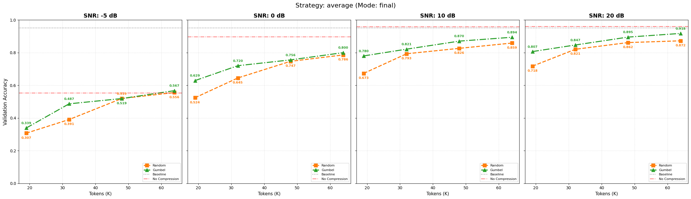
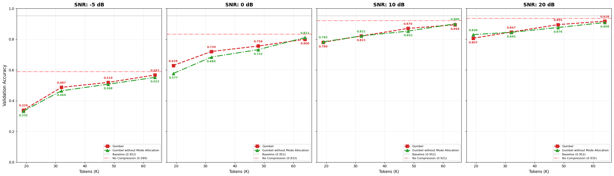
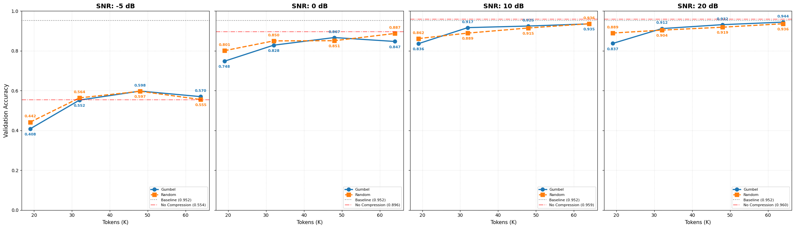
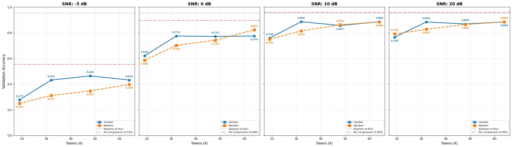
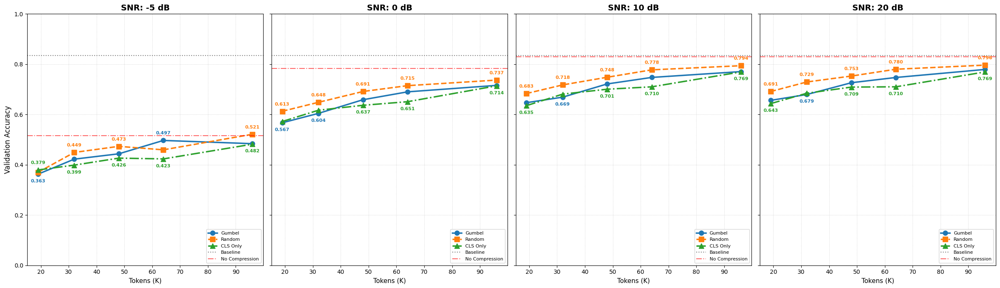

# Update 30/04 - Analysis with MIMO channel

After obtaining satisfactory results with the AWGN channel, we decided to evaluate the model's performance under more realistic channel conditions, specifically using a MIMO channel.
The results show that the Gumbel-softmax selection method outperforms random selection also in this case.

In addition, we analyzed the effect of the disablement of the mode allocation in the MIMO channel, which resulted no significant impact on the performance of either selection method. The plot below shows the comparison between the two methods with and without mode allocation.

In detail, we have run the experiments by insert the split Layer in the first block and we have considered a MIMO channel composed of 4 antennas for each side. For what concerns the Gumbel-Softmax method we have disabled the additional power that we perform into the mode allocation, so we essentialy allocate only the more important tokens in the more important modes.

# Update 26/04 - Change of the splitted layer

Because CIFAR-100 images are only 32×32 and the transformer requires a larger input, we perform an upscaling operation. To avoid excessive resizing, we decided to try a dataset whose default size is closer to the transformer's requirement (224×224). Therefore, we chose the Flowers-102 dataset, whose images naturally fit within a maximum side length of 512.

The last change concerns the model split. Instead of splitting the model after the 3rd transformer block, we split it after the 1st transformer block. The results show that splitting the model after the 1st transformer block provides evidence that the more sophisticated Gumbel method has better performance compared to the simple random selection. In detail, we observe better performance in the scenario with enough tokens sent (around 32/48 tokens) and poor SNR (around -5/0 dB). In this case, the Gumbel method outperforms random selection by about +10% in accuracy. The plots below show the comparison across different split points.

This for split in the 3rd layer:

This for split in the 1st layer:

# Update 23/04 - Comparison with the selection of top k tokens based on their CLS token attention weights

To contestualize the results, we compared the Gumbel-Softmax selection with a greedy approach: selecting the top k tokens based on their CLS token attention weights.

At the same time, the gumbel-softmax method was improved under the management of probability of selection with the introduction of an entropy bottleneck.

The plots below show the comparison across different SNR regimes:

# Update 21/04 - Comparison between random selection and Gumbel-Softmax selection for different compression levels

To more concretely investigate the differences between the two methods, we tested various scenarios to observe how the two techniques vary depending on the number of tokens being transmitted. The following charts show the comparison across different SNR regimes:

 |

# Experimental Results Overview

This document summarizes the simulation results obtained from the split-learning pipeline, focusing on the model's resilience to token selection and bottleneck compression under noisy communication channels (AWGN and MIMO).

## 1. Reference Scenario: Ideal Conditions
The baseline for this study is the **S1_CLEAN** scenario, where neither compression nor channel noise is introduced. Both training and validation are performed under ideal conditions (identity channel, full resolution). This serves as the upper-bound performance metric for the DeiT-Tiny model on the CIFAR-100 dataset.

## 2. Robust Communication (No Compression)
In the second scenario, we evaluate the impact of noisy channels (AWGN and MIMO) without dimensionality reduction. The model is trained and validated with the channel active, fostering internal robustness to noise. This allows us to quantify the performance degradation caused solely by the physical layer artifact before introducing semantic bottlenecks.

## 3. Semantic Token Selection (10% Token Budget)
The most constrained setting involves reducing the transmitted data to only **10% of the total tokens**. We compare two strategies:
- **Gumbel-Softmax Selection**: A learned policy that identifies and transmits only the most semantically important tokens.
- **Random Selection**: A baseline strategy that stochasticity selects 10% of the tokens.

By comparing these two approaches, we demonstrate the effectiveness of importance-aware selection in maintaining high accuracy despite massive data reduction.

## 4. Dimensionality Reduction (Bottleneck Compression)
In addition to spatial token selection, we implement a scenario involving **channel-wise dimensionality reduction** through a linear bottleneck. The combined effect of spatial (token) and spectral (bottleneck) compression is illustrated below. While these combined mechanisms maximize communication efficiency, they also impose the most significant stress on the model's predictive capability.

## 5. Summary and Detailed Analysis
The results highlight a fundamental trade-off between communication overhead (SNR/Bandwidth) and semantic accuracy. While learned token selection preserves more informative features than random sampling, the cumulative effect of multiple compression stages requires careful SNR management.

For a more comprehensive technical discussion of the individual scenarios (S1-S6) and the specific code optimizations implemented, please refer to the [Baseline Description](baseline_description.md) document.
