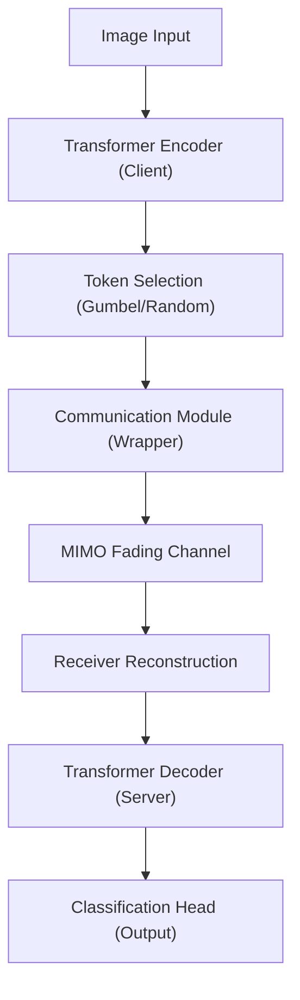

# Joint Source-Channel Coding and Split-Computing Transformer System: Documentation

This document provides a formal, comprehensive description of the joint source-channel coding (JSCC) and split-computing transformer system designed for image classification over wireless multiple-input multiple-output (MIMO) channels.

---

## Part 1: Module-Level Documentation

### 1. `main.py`
* **Purpose**: Orchestrates the training, validation, and evaluation loops of the split-computing network. It handles seed execution, Hydra configuration instantiations, learning rate group schedules, evaluation SNR sweeps, diagnostic logging, and visualization plotting.
* **Inputs**:
  - `cfg` (OmegaConf DictConfig): Dict-like configuration hierarchy containing dataset, model, optimizer, communication, and method parameter specifications.
* **Outputs**:
  - Training metrics logs (`final_training_results.json`, `best_training_results.json`).
  - Diagnostic logs (`diagnostic_gumbel.json`).
  - Visual verification plots (`visual_comp_random.png`).
* **Dependencies**: `os`, `re`, `random`, `hydra`, `torch`, `json`, `tqdm`, `numpy`, `matplotlib`, `omegaconf`.
* **Implementation Details**:
  - **SNR Training Schedule**: Dynamic SNR sampling within ranges (default $[0.0, 20.0]$ dB for the first $80\%$ of epochs and $[10.0, 20.0]$ dB for the final $20\%$ of epochs) is applied during training.
  - **Optimizer Parameter Grouping**: Segregates parameters into three functional optimization groups:
    - *Encoder*: LR scaled by $0.1$ with standard weight decay to protect pre-trained weights.
    - *Decoder/Head*: LR scaled by $1.0$ with standard weight decay.
    - *Score Head (Simplicial Gumbel)*: LR scaled by $5.0$. Applies a moderate weight decay ($1\times 10^{-3}$) on 2D parameters to naturally cap logit variance and prevent saturation, with no weight decay ($0.0$) on 1D biases and scale parameters.
  - **Telemetry Logging**: Writes epoch-level statistics, transmission metrics (transmitted tokens, symbols, symbol rates), and Gumbel curriculum analytics to disk.
* **Assumptions**: 
  - Input images are normalized and resized to $224 \times 224$ pixels.
  - The model contains split components linked through custom adapters.

---

### 2. `downloader.py`
* **Purpose**: Caches datasets and pretrained model weights to local storage prior to training.
* **Inputs**: None.
* **Outputs**:
  - Downloaded datasets under the `./data` directory (CIFAR-100, Food-101, Imagenette).
  - Downloaded pretrained model weights from the Hugging Face hub/timm repository.
* **Dependencies**: `datasets`, `timm`, `torchvision`.
* **Implementation Details**: Uses standard APIs `torchvision.datasets` and `timm.create_model` with `download=True` and `pretrained=True`.
* **Assumptions**: Active internet connection and adequate storage space.

---

### 3. `comm/communication.py`
* **Purpose**: Simulates an analog communication channel or acts as an identity pass-through.
* **Inputs**:
  - `tensor` (torch.Tensor): Feature representations to transmit.
* **Outputs**:
  - `noisy_tensor` (torch.Tensor): Output tensor after noise corruption (or pass-through).
* **Dependencies**: `torch`, `torch.nn`, `math`, `typing`.
* **Implementation Details**:
  - `AnalogGaussianNoiseChannel`: Computes the signal power $P_{\text{sig}}$ over specified dimensions. Adds Additive White Gaussian Noise (AWGN) during training. The noise power is computed based on a randomly sampled SNR:
    $$\text{SNR}_{\text{linear}} = 10^{\frac{\text{SNR}_{\text{dB}}}{10}}$$
    $$\sigma^2 = \frac{P_{\text{sig}}}{\text{SNR}_{\text{linear}}}$$
    $$\text{noise} \sim \mathcal{N}(0, \sigma^2)$$
  - `Identity` / `IdentityWrapper`: Act as basic pass-through layers in the pipeline when communication simulation is disabled.
* **Assumptions**: Noisy corruption is only active when `self.training` is `True`. During evaluation, it operates as a pass-through (unless overridden by wrapping logic).

---

### 4. `comm/mimo.py`
* **Purpose**: Simulates a multi-antenna fading channel ($Y = HS + N$) with linear equalization (Zero Forcing or Minimum Mean Square Error) and handles symbol packing/unpacking.
* **Inputs**:
  - `s` (torch.Tensor): Transmit symbols of shape $[B, N_{\text{tx}}, T]$.
* **Outputs**:
  - `s_hat` (torch.Tensor): Equalized symbols of shape $[B, N_{\text{tx}}, T]$.
  - `stats` (dict): Measured SNR values (pre/post-equalization), signal power, noise power, and channel matrix condition stats.
* **Dependencies**: `math`, `typing`, `collections.abc`, `torch`.
* **Implementation Details**:
  - `pack_tokens_to_mimo_symbols`: Packs features $[B, N_{\text{tokens}}, D]$ into spatial-temporal symbol matrix $[B, N_{\text{tx}}, T]$ with zero padding.
  - `unpack_mimo_symbols_to_tokens`: Recovers token format $[B, N_{\text{tokens}}, D]$ from equalized symbols, discarding padding.
  - `MIMOAWGNChannel`:
    - **Fading Modes**: Rayleigh fading (coefficients drawn from complex-normal equivalent real representations with variance $1/N_{\text{tx}}$), Identity, or Diagonal fading.
    - **Diagonal Fading Gains**: Can be fixed, or dynamically sampled from Uniform or Lognormal distributions.
    - **Equalization**:
      - *Zero Forcing (ZF)*: $\hat{S} = H^{\dagger} Y = (H^T H)^{-1} H^T Y$.
      - *MMSE*: $\hat{S} = (H^T H + (\sigma^2 + \epsilon) W^{-1})^{-1} H^T Y$, where $W$ is the diagonal stream power allocation matrix.
    - **MPS/Numerical Stability**: Detects MPS devices and applies diagonal jitter/perturbation ($\epsilon I$) if SVD or matrix inversion fails.
* **Assumptions**: Channel parameters are perfectly estimated at the receiver (perfect CSI).

---

### 5. `comm/dct.py`
* **Purpose**: Computes spatial Discrete Cosine Transform (DCT-II) and Inverse Discrete Cosine Transform (IDCT-III) to compact energy across MIMO spatial modes.
* **Inputs**:
  - `signal` (torch.Tensor): Signal of shape $[B, K_{\text{active}}, T]$ in spatial domain.
* **Outputs**:
  - Spatially transformed signal in DCT domain.
* **Dependencies**: `math`, `typing`, `torch`.
* **Implementation Details**:
  - **Unitary Matrix Construction**: Computes orthonormal DCT-II matrices using double-precision floats to guarantee orthogonality, then casts to the active dtype.
  - **Caching**: Employs a module-level dictionary `_dct_cache` to store computed matrices indexed by $(k, \text{device}, \text{dtype})$, bypassing redundant matrix calculations.
  - **Autograd Compatibility**: Builds matrices inside `torch.no_grad()` and detaches them. Gradients flow through the input signal but not the basis itself.
* **Assumptions**: The signal dimension matches the transform rank $K_{\text{active}}$.

---

### 6. `comm/bottleneck.py`
* **Purpose**: Implements linear projections to reduce feature dimensionality before channel transmission and reconstructs them at the receiver.
* **Inputs**:
  - `x` (torch.Tensor): Token features of shape $[B, N, D_{\text{in}}]$.
* **Outputs**:
  - `z` (torch.Tensor): Bottlenecked features of shape $[B, N, D_{\text{out}}]$.
  - `x_hat` (torch.Tensor): Reconstructed features of shape $[B, N, D_{\text{in}}]$.
* **Dependencies**: `torch.nn`.
* **Implementation Details**: Houses two `nn.Linear` layers: `compressor` ($D_{\text{in}} \rightarrow D_{\text{out}}$) and `decompressor` ($D_{\text{out}} \rightarrow D_{\text{in}}$).
* **Assumptions**: Latent features are projection-friendly.

---

### 7. `comm/comm_module_wrapper.py`
* **Purpose**: Adapts the `CommModule` to fit standard PyTorch sequential structures while routing selection scores, applying power limits, and tracking reconstruction fidelity.
* **Inputs**:
  - `x` (torch.Tensor): Intermediate representations of shape $[B, N, D]$.
* **Outputs**:
  - `out` (torch.Tensor): Reconstructed features of shape $[B, N, D]$.
* **Dependencies**: `torch`, `torch.nn`, `comm.comm_module`.
* **Implementation Details**:
  - **Score Alignment**: Extracts attention maps from upstream compressor layers, strips the class token (index 0) to align with patch dimensions, resulting in a score matrix of shape $[B, N-1]$.
  - **Pre-Channel Normalization**: Enforces average RMS normalization to $1.0$ across active channels to prevent learning models from circumventing channel noise by scaling up features.
  - **Metrics Telemetry**: Records reconstruction MSE of the class token (`cls_mse`) and measures signal distortion.
  - **Curriculum & Sweeps**: Exposes `reconfigure` for evaluation SNR sweeps.
* **Assumptions**: Class token is placed at index 0 of the token sequence.

---

### 8. `comm/comm_module.py`
* **Purpose**: Central communication module coordinating power scaling, spatial mode assignments, SVD mode allocation, and DCT spatial diversity.
* **Inputs**:
  - `x` (torch.Tensor): Token representations of shape $[B, N, D]$.
  - `selection_indices` (torch.Tensor, optional): Indices of the selected tokens.
  - `selection_scores` (torch.Tensor, optional): Attention/Gumbel scores of the active tokens.
* **Outputs**:
  - `out` (torch.Tensor): Reconstructed features.
  - `info` (dict): Channel states, allocation weights, and symbol rates.
* **Dependencies**: `logging`, `collections.abc`, `torch`, `torch.nn`, `copy`, `comm.bottleneck`, `comm.mimo`, `comm.dct`.
* **Implementation Details**:
  - **Power Allocation**: Modulates token energy:
    $$w_i = (s_i + \epsilon)^{\alpha}$$
    where $s_i$ is the token score, normalized such that $\sum w_i = N$. It supports SNR-adaptive tempering where $\alpha$ sigmoideally approaches $0$ at high SNR levels.
  - **Stream Allocation**: Employs "importance_to_gain" mapping, sorting tokens by selection scores and mapping them to antennas ordered by channel gains.
  - **SVD Mode Allocation**: Performs singular value decomposition of the channel matrix $H = U \Sigma V^T$. Maps sorted tokens to virtual SVD channels, prioritizing high-capacity modes. Weak modes are pruned if their singular values fall below a relative threshold. The mode allocation exponent and pruning threshold are dynamically tempered based on the channel SNR.
  - **DCT Spatial Diversity (CLS-Bypass with Dynamic Pooling)**:
    - *Phase 1 (Time slots $1 \dots T_1$)*: The critical CLS token is transmitted exclusively over SVD Mode 0 with an power boost $\sqrt{\beta}$. The remaining patches are mapped to spatial modes $1 \dots K_b-1$, spatially transformed via a $(K_b-1)\times(K_b-1)$ DCT-II, and normalized.
    - *Phase 2 (Time slots $T_1+1 \dots T_b$)*: SVD Mode 0 is pooled back into the patch transmission matrix. Remaining patches are transmitted across all $K_b$ modes using a $K_b\times K_b$ DCT-II.
    - *Receiver*: Performs symmetric operations using transposed SVD matrices and IDCT-II.
* **Assumptions**: Perfect receiver equalization.

---

### 9. `methods/gumbel_method.py`
* **Purpose**: Implements Gumbel-Softmax token selection driven by a simplicial interaction graph, curriculum learning schedules, and server attention trackers.
* **Inputs**:
  - `x` (torch.Tensor): Input sequence from encoder blocks.
* **Outputs**:
  - `x_sel` (torch.Tensor): Selected sequence of shape $[B, 1+K, D]$.
* **Dependencies**: `math`, `logging`, `weakref`, `torch`, `torch.nn`, `torch.nn.functional`, `timm`, `methods.token_utils`.
* **Implementation Details**:
  - **Simplicial Interaction Graph**: Incorporates both native transformer attention and a projected geometric interaction branch:
    $$\text{logits} = \text{LN}(a_{\text{cls}}) + \text{sigmoid}(g) \cdot \gamma \cdot \text{LN}(\|W_u(X_{\text{cls}}) \odot W_{\text{tri}}(X_{\text{patch}})\|_2)$$
    where LN is Layer Normalization, $g$ is a learnable gating parameter, and $\gamma$ is a contrast scaling factor.
  - **Curriculum Learning**:
    - *Dynamic Logit Scaling*: Multiplies logits by $\alpha_{\text{scale}}$ (sweeps from `logit_scale_start` to `logit_scale_end` over epochs).
    - *Entropy Bottleneck Loss*: Computes soft loss regularizer:
      $$\mathcal{L}_{\text{entropy}} = \lambda \max(0, H_{\text{actual}} - H_{\text{target}}(\text{epoch}))$$
      where $H_{\text{target}}$ decreases linearly across epochs, preventing early collapse.
    - *Stability Bonus*: Adds a scaled EMA of patch selection frequencies to the logits to stabilize selection.
  - **Server Attention Entropy Tracker**: Wraps server-side block attentions to compute Shannon entropy:
    $$H = -\frac{1}{B \cdot H \cdot N} \sum_{b,h,q,k} A_{b,h,q,k} \ln(A_{b,h,q,k} + \epsilon)$$
* **Assumptions**: Fits standard timm VisionTransformer backbones.

---

### 10. `methods/random_sp.py`
* **Purpose**: Provides a random token selection baseline equipped with diversity-aware selection and CLS-neighbor options.
* **Inputs**:
  - `tokens` (torch.Tensor): Input token representations.
* **Outputs**:
  - Selected tokens and index records.
* **Dependencies**: `torch`, `torch.nn`, `torch.nn.functional`, `logging`, `weakref`, `timm`, `methods.token_utils`.
* **Implementation Details**:
  - **Diversity-Aware Greedy Selection**: Employs a similarity penalty to avoid choosing redundant tokens:
    $$\text{objective}_j = \text{score}_j - \lambda \max_{k \in \text{selected}} \text{sim}(u_j, u_k)$$
    where similarity $\text{sim}(\cdot)$ can be Cosine Similarity or negative $L_2$ distance.
  - **CLS-Neighbor Option**: Forces the inclusion of the top $m$ patch tokens displaying the highest CLS attention.
* **Assumptions**: Bypasses the Gumbel-Softmax training logic.

---

### 11. `methods/token_utils.py`
* **Purpose**: Contains token gathering and transformer attention tracking wrappers.
* **Inputs**:
  - `tokens` (torch.Tensor): Input representations.
  - `indices` (torch.Tensor): Selection indices.
* **Outputs**:
  - `gathered_tokens` (torch.Tensor): Gathered tokens.
* **Dependencies**: `torch`, `torch.nn`.
* **Implementation Details**:
  - `gather_tokens`: Performs sequence-dimension gathering.
  - `ClassTokenAttentionTrackerWrapper`: Intercepts the attention map of the ViT block and stores the average attention from the CLS token to all patches:
    $$\text{class\_token\_attention} = \text{mean}_{\text{heads}}(A[:, :, 0, :])$$
    which results in a tensor of shape $[B, N]$.
* **Assumptions**: The first token in the sequence (index 0) corresponds to the CLS token.

---

## Part 2: System Architecture

### 1. System Overview
The system implements a joint source-channel coding (JSCC) pipeline integrated with split-computing for image classification. By splitting a Vision Transformer (ViT) model, heavy feature extraction (client-side backbone blocks) is separated from classification (server-side blocks). To communicate over a resource-constrained wireless MIMO channel, a Gumbel-Softmax selector filters out less important tokens. The remaining features are bottlenecked, allocated power semantically, mapped onto spatial MIMO modes (using SVD or DCT transformations), transmitted, equalized, and reconstructed.



---

### 2. End-to-End Pipeline

The end-to-end pipeline consists of the following processing stages:

1. **Input**: A batch of raw images of shape $[B, 3, 224, 224]$.
2. **Transformer Encoder**: Processing by the initial $S$ transformer blocks (where $S$ is the `split_index`). The output features have shape $[B, N_{\text{tokens}}, D]$ (e.g., $N_{\text{tokens}} = 197$, $D = 192$ for DeiT-tiny).
3. **Token Selection**:
   - The CLS token is always retained.
   - For Gumbel-Softmax selection, the simplicial graph computes logits. Soft probabilities are obtained, and $K$ patch tokens are sampled, yielding selected tokens of shape $[B, 1+K, D]$.
4. **Communication Module (Client)**:
   - *Bottleneck (optional)*: Applies linear projection mapping to shape $[B, 1+K, D_{\text{bottleneck}}]$.
   - *Power / Mode Allocation*:
     - *ISW Mode*: Scales token energy based on scores, then packs them into symbol matrix $[B, N_{\text{tx}}, T]$. It resolves virtual SVD channels ($H = U\Sigma V^T$) and maps symbols to modes.
     - *DCT Spatial Mode*: Bypasses SVD mapping. Packs tokens. Phase 1 maps CLS over Mode 0 (boosted by $\sqrt{\beta}$) and applies a $(K_b-1)\times(K_b-1)$ spatial DCT-II on patches. Phase 2 pools Mode 0 back and applies a $K_b\times K_b$ DCT-II. Projects modes to antennas: $S_{\text{ant}} = V_b S_{\text{mode}}$.
5. **MIMO Channel**: Simulates the transmission:
   $$Y = H S_{\text{ant}} + N$$
   where $H$ represents Rayleigh fading, identity, or diagonal gains, and $N$ is AWGN.
6. **Reconstruction (Server)**:
   - *Equalization*: Linear equalization yields $\hat{S}_{\text{ant}}$ via ZF or MMSE.
   - *Unpacking*:
     - *ISW Mode*: Projects equalized symbols back to virtual modes via $V^T$, reverses importance mapping, and unpacks to $[B, 1+K, D_{\text{bottleneck}}]$.
     - *DCT Spatial Mode*: Reconstructs Phase 1 (IDCT on patches, scale-down on CLS) and Phase 2 (IDCT on remaining patches), assembling them back to $[B, 1+K, D_{\text{bottleneck}}]$.
   - *De-bottleneck*: Linear expansion back to shape $[B, 1+K, D]$.
7. **Decoder**: Server-side transformer blocks ($split\_index \dots 12$) process the reconstructed tokens.
8. **Output**: The prediction head maps the server's output CLS token representation to classification probabilities $[B, N_{\text{classes}}]$.

---

### 3. Component Architecture

```
+-------------------------------------------------------------------------------+
|                             CLIENT-SIDE (Backbone)                            |
|                                                                               |
|  [Input Image] -> [ViT Blocks 0..S-2] -> [Block S-1 Attn Tracker]            |
|                                                     |                         |
|  [Selected Tokens] <- [Token Selector Block Wrapper (Gumbel/Random)]          |
|          |                                                                    |
|  [Transmitted Symbols] <- [CommModuleWrapper (RMS Normalization & Packing)]   |
+-------------------------------------------------------------------------------+
                                       |
                              [Wireless Channel] (Rayleigh / MMSE / AWGN)
                                       |
+-------------------------------------------------------------------------------+
|                             SERVER-SIDE (Decoder)                             |
|                                                                               |
|  [Equalized Tensors] -> [Unpacker / Linear Decompressor]                      |
|                                |                                              |
|  [Output logits] <- [Prediction Head] <- [Server Blocks S..11 + Entropy Track] |
+-------------------------------------------------------------------------------+
```

* **Client Backbone Blocks**: Extract raw spatial-visual features and compute the attention weights of the class token.
* **Token Selector**: Applies Gumbel-Softmax or Random selection to compress the token sequence.
* **Comm Wrapper & Module**: Controls signal scaling, maps tokens to spatial paths, and simulates antenna transmission.
* **Receiver Equalizer**: Computes MMSE or Zero-Forcing solutions to decouple antenna signals.
* **Server Decoder Blocks**: Extract deep semantic representations from the received tokens and compute attention entropy.
* **Prediction Head**: Output linear layer producing target class probabilities.

---

### 4. Data Flow Analysis

The mathematical tensor shapes and transformations at key boundary points are detailed below (assuming $B=128$, $N_{\text{tokens}}=197$, $D=192$, $K=20$, $D_{\text{bottleneck}}=128$, $N_{\text{tx}}=N_{\text{rx}}=4$):

| Point / Boundary | Tensor Shape | Representation / Domain |
| :--- | :--- | :--- |
| Image Input | $[128, 3, 224, 224]$ | Pixels |
| Split point pre-selector | $[128, 197, 192]$ | Client latent features |
| Split point post-selector | $[128, 21, 192]$ | Selected latents (1 CLS + 20 Patches) |
| Bottleneck output | $[128, 21, 128]$ | Compressed latents |
| MIMO Input (packed) | $[128, 4, 672]$ | Transmit symbols ($T = \lceil 21 \times 128 / 4 \rceil = 672$) |
| Fading Channel Output | $[128, 4, 672]$ | Received antenna symbols |
| Equalizer Output | $[128, 4, 672]$ | Equalized antenna symbols |
| Unpacked features | $[128, 21, 128]$ | Reconstructed bottleneck features |
| De-bottleneck output | $[128, 21, 192]$ | Server input features |
| Classification output | $[128, 100]$ | Probability logits |

* **Split Boundary**: Positioned immediately after block $S-1$ (where $S$ is `split_index`).
* **Client Responsibilities**: Feature extraction, token importance scoring, selection, linear compression, spatial mapping, and power scaling.
* **Server Responsibilities**: Channel equalization, spatial demultiplexing, linear decompression, transformer decoding, and classification.

---

### 5. Training Workflow

The training process follows a curriculum designed to stabilize the Gumbel-Softmax selection:

1. **SNR Curriculum**: Training SNR is sampled uniformly from $[0.0, 20.0]$ dB for the first $80\%$ of epochs to teach the model to handle diverse noise conditions, and is restricted to $[10.0, 20.0]$ dB for the last $20\%$ of epochs to refine high-fidelity reconstruction.
2. **Temperature Annealing**: The Gumbel temperature $\tau$ decays from $\tau_{\text{start}} = 1.8$ to $\tau_{\text{end}} = 1.05$ following a cosine schedule:
   $$\tau = \tau_{\text{min}} + 0.5(\tau_{\text{max}} - \tau_{\text{min}})\left(1 + \cos\left(\pi \frac{t}{T}\right)\right)$$
3. **Logit Scaling Curriculum**: Direct divisions by low temperatures early in training can cause gradient instability. The logit scale $\alpha_{\text{scale}}$ is therefore swept from $0.4$ to $0.65$. This keeps logits small early on (resulting in near-uniform selection) and increases them as training matures.
4. **Loss Formulation**: The total training loss is:
   $$\mathcal{L}_{\text{total}} = \mathcal{L}_{\text{cross-entropy}} + \lambda_{\text{entropy}} \max\left(0, H_{\text{actual}} - H_{\text{target}}(\text{epoch})\right)$$
   where $H_{\text{target}}$ decreases from $5.2$ to $3.5$ to slowly guide the selection distribution from high entropy (uniform) to low entropy (sharp selection).
5. **Parameter Segregation**: Differing learning rates and weight decays (as detailed in the `main.py` section) prevent the score head from saturating while protecting the pretrained ViT weights.

---

### 6. Evaluation Workflow

During evaluation, the model undergoes performance profiling:

1. **SNR Sweep**: Evaluates accuracy across a set of SNR levels (e.g., $[-5, 0, 10, 20]$ dB). The channel is reconfigured dynamically at each step.
2. **Monte Carlo Gumbel Aggregation**: If enabled, Gumbel perturbations are sampled $M=16$ times at $\tau = 0.3$, and the selection probabilities are averaged to reduce noise variance.
3. **Bypass Validation**: Supports evaluation with the radio channel disabled (`clean_validation`) to measure the performance ceiling of the token compressor.
4. **Metrics Evaluated**:
   - Classification accuracy and loss.
   - Spatial mode condition metrics (Gains, pruning ratios, Gini coefficients).
   - Reconstructed CLS MSE (`cls_mse`).
   - Server attention entropy (`server_attn_entropy`) to quantify the impact of channel noise on the attention maps.
